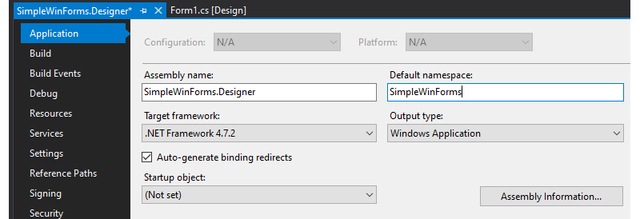
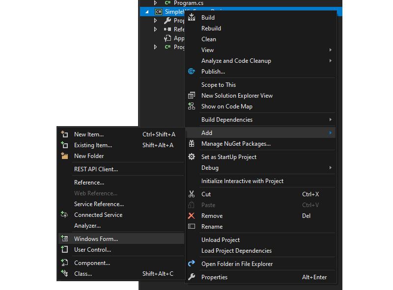
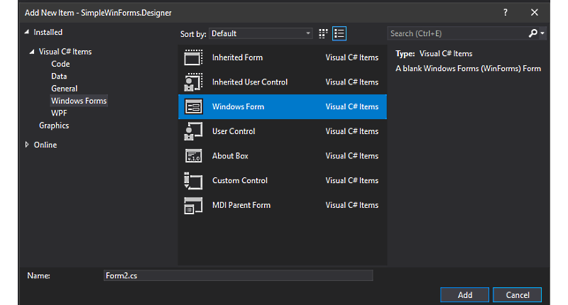
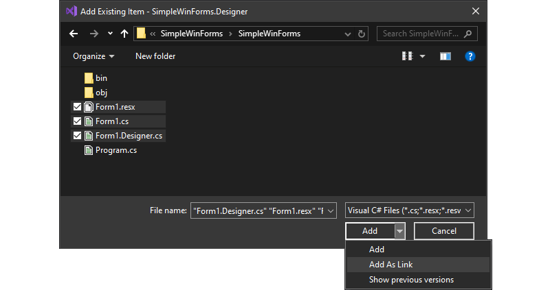

# Using the Classic WinForms Designer in WinForms Core

At this point, a dedicated WinForms Designer for WinForms Core is not yet available. As a workaround, you can use Visual Studio's option to work with linked files and use its WinForms Designer for the Classic Framework.

Here is, how it is done:

**TIP:** During the process, you need to re-nest Form files in the Classic Framework WinForms project whenever you add a new Form or a new UserControl. Instead of using a text editor for patching the project file, you can use Mad Kristensen's [File Nesting Extension]( https://marketplace.visualstudio.com/items?itemName=MadsKristensen.FileNesting), which is recommended to be installed beforehand. Please close every open instance of Visual Studio before installing this extension.

## Creating a WinForms Core App

Visual Studio does not allow it currently to create a new WinForms Core App from within Visual Studio directly. If you want to design an WinForms Core app, you need to create the App first from the command line:

Open your favorite console, and create a new folder with the application's name. The folder name will later become the project's name as well. Change to that folder.
```
md MyNewWinFormsProject
cd MyNewWinFormsProject
```

Now, create a new WinForms application with the `dotnet new` command, using the templates for WinForms. Run:
```
dotnet new winforms
```

**TIP:** You can have the folder name different from the project's name. Use the option `-n` (or `-name`) for that when using `dotnet new`.

**NOTE:** Templates for **Visual Basic** are currently in development (so `dotnet new winforms -lang VB` will eventually work!), but they are not available yet. Visual Basic, however, is already supported; as a workaround for the time being, you can create an empty Core Console VB app, and rename and patch the project files accordingly (just copy those definitions over from a C# app). Also note that the Application Framework in Visual Basic is not supported in this version.

After creating it, you can test the App directly by starting it with

```
dotnet run
```

which builds and starts the App. 

**TIP:** If you only want to rebuild the App, use:

```
dotnet build
```

## Preparing the WinForms Core App for the Classic Designer

1. Start Visual Studio and open this project.
2. Save the project in Visual Studio, and with that, also save the Solution file.
3. Open the context menu of the solution (not the project!) in the Solution Explorer and chose *Add New Project*.


4. In the *Installed Templates* section, pick *Visual C#* (this works for Visual Basic equally — see the comments for Visual Basic above, though), *Windows Desktop*, and then click *Windows Forms App (.NET Framework)* from the list of installed templates.


5. Name the new classic Framework project as the Core project, but add `.Designer` to it (For example, if your Core project is named `MyWinFormApp`, name the classic Framework App `MyWinFormsApp.Designer`).
6. In the properties of the Classic Framework Application (context menu on the project in the Solution Explorer), rename the default namespace to the Core Application's default namespace.



7. Erase the existing Form files in both projects.

**Important:** The following steps you always repeat, when you need to insert a new Form or a new UserControl.

1. In the Classing Framework project, open the project's context menu, and click *Add New Item*.



2. In the section list, click on *Windows Forms*, and chose *Windows Form* from the installed templates.



3. Enter the name for the new Form/User Control.
4. Click *Add*.
 **IMPORTANT**: Now, cause some change in the Designer on the form. For example, resize the form for a couple of pixels, or change the Text property of the form, so the resource file for it can be generated and saved. After that, save the form.

5. In the Solution Explorer, click on the form, and press (Ctrl)(x) to cut it the file.
6. Select the Core WinForms project in the Solution Explorer, and press (Ctrl)(v) to insert the files. Check that the main form file, the .designer file and the resource file for the form are all present.
7. Now, to have the exact same file back in the WinForms Classic Framework Designer, we need to use Visual Studio's file link option. Remember: We can only use the Classic Designer, but we want to have only one set of files. So, the form files, of course, belong to the Core App. But we want to edit them in the context of the Classic Framework App (thus using the Classic Designer). So, we link the existing Core Form files to the classic app, and to this end, you open the context menu on the classic project in the solution explorer, and pick *Add* and *Existing Item*.
8. In the File Open Dialog, navigate to the Core app, and find the *Form.cs*, *Form.Designer.cs* and *Form.resx* files. (Replace *Form* by the name of your form.) Select all of them, but DO NOT click *Add* yet!



9. Open the pulldown menu of the *Add* dropdown button and click *Add as Link*.
10. Compile the solution to see if the file references got set up correctly.
11. As the last but important step, we need to re-nest the linked form files. If you installed the *File Nesting* Visual Studio Extension (see above), then that is done easily: Select both the *Form.Designer.cs* and *Form.resx* file, and from the context menu click *File Nesting* and *Nest Items*. In the dialog, pick the main form file (Form.cs), and click OK.

Now, whenever you need to use the Designer on one of the Core Form or UserControl files, simply open the linked files in the Classic Framework project with the Classic Windows Forms Designer.
