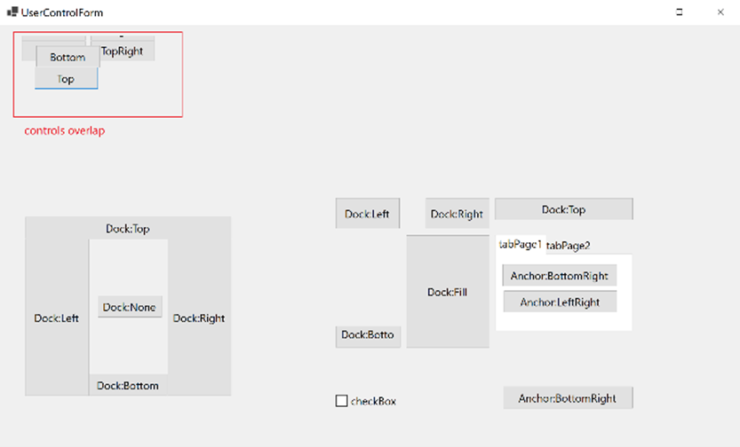
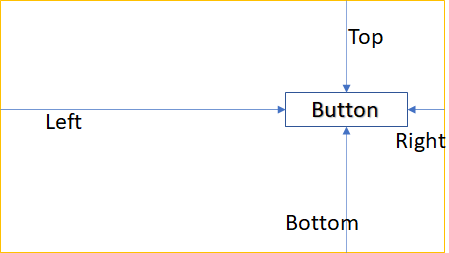

# Anchor layout changes in .NET 8.0
## Description:
We have multiple [issues](https://github.com/dotnet/winforms/issues?q=is%3Aissue+is%3Aopen+anchor+-label%3Atest-bug+-label%3A%22%3Aconstruction%3A+work+in+progress%22+-label%3Aapi-suggestion+-label%3Aapi-approved+-label%3Atenet-localization) reported in WinForms around the anchor layout being problematic on higher DPI scale monitors, irrespective of application DPI mode. This document outlines the changes being made in .NET 8.0 to address these issues along with setting the goal to support all supported application DPI modes in WinForms.
## Problem in Scope:
Anchored control’s position with respect to its parent should be able to determine at the design time and would only need to be changed   if there were explicit changes in the control’s Bounds or when the control is scaled in response to a DPI changed event. Bounds changes as result of Parent’s bounds change shouldn’t alter control’s relative position in the parent’s rectangle. However, layout in WinForms computes the anchored control’s position every time there are changes to control’s bounds or control’s property change that may impact its position. This is leading to the [issues](https://github.com/dotnet/winforms/issues?q=is%3Aissue+is%3Aopen+anchor+-label%3Atest-bug+-label%3A%22%3Aconstruction%3A+work+in+progress%22+-label%3Aapi-suggestion+-label%3Aapi-approved+-label%3Atenet-localization)  we have been seeing . The following is a source snippet that is being serialized in WinForms designer and added comments show the various events that trigger anchor computations and why they could be wrong or unnecessary.

```CS
// Following line trigger layout to compute anchors with default button size and without parent.
this.button7.Anchor = ((System.Windows.Forms.AnchorStyles)((System.Windows.Forms.AnchorStyles.Left | System.Windows.Forms.AnchorStyles.Right)));

// Following line trigger layout again to compute anchors with default button size with new location and still without parent.
this.button7.Location = new System.Drawing.Point(9, 47);

// Following line trigger layout again to compute anchors with button's new size and still without parent.
this.button7.Size = new System.Drawing.Size(134, 23);

// Following line trigger layout to compute anchors with button's current size and default size for parent.
this.Controls.Add(button7);

// Following line trigger layout to compute anchors with button's current size and new size for parent.
// These size still may be changed for the DPI on the monitor depending on application's DPI mode
this.Size = new System.Drawing.Size(828, 146);

// Following line trigger layout to compute anchors with button's
current size and new size for parent.
// DPI on the monitor still not applied.
this.ResumeLayout(false)
```
The above snippet does not represent the complete set of instances where anchor computations are unnecessary and may hold invalid anchor values. It gets even more complicated when nested UserControls are involved.

## Known issues:
We have multiple issues reported [here](https://github.com/dotnet/winforms/issues?q=is%3Aissue+is%3Aopen+anchor+-label%3Atest-bug+-label%3A%22%3Aconstruction%3A+work+in+progress%22+-label%3Aapi-suggestion+-label%3Aapi-approved+-label%3Atenet-localization) from customers and some of them are direct result of anchor miscalculations. The following are snippets of the category of issues we currently see.
### Missing controls:
Calculation of control's anchors with default sizes may result in negative anchors and thus result in invalid location for the anchored controls.


### Overlapped Controls:
Along with above reason, If we happened to scale parent control to match with current monitors DPI and child control's anchor calculations happen out of sync with this scaling, we may see issues like in below pic.


## Anchor Calculations:
The following image illustrates how we calculate anchors with respect to a control’s parent’s display rectangle. Rectangle marked in `red` is Parent’s display rectangle while the rectangle marked in `green` is anchored control’s (button) bounds.
- `Left` arrow indicates the X co-ordinate of the button location with respect to parents display rectangle.
- `Top` arrow indicates the Y co-ordinate of the button location with respect to parents display rectangle.
- `Right` arrow indicates the distance from right edge of parent’s rectangle where button is placed.
- `Right` arrow indicates the distance from bottom edge of parent’s rectangle where button is placed.

    

In the above picture the boundary marked in `red` is a container hosting the control (boundary marked with `green`). The control can define its anchor property to explicitly tell the layout engine how its bounds change relative to its parent’s bounds. Ex. 
```CS
this.button14.Anchor = (System.Windows.Forms.AnchorStyles.Bottom
 | System.Windows.Forms.AnchorStyles.Left
 | System.Windows.Forms.AnchorStyles.Top
 | System.Windows.Forms.AnchorStyles.Right );
```
When Control’s Anchor property is set, we compute anchors (left, top, right, bottom values) and store them in an internal struct `AnchorInfo`. We expect these anchor values to be in negative only when the button is placed/position outside/overlapped with the hosting controls bounds.

## Proposed solution:
Unnecessary control’s anchors computation is the root cause for many [issues](https://github.com/dotnet/winforms/issues?q=is%3Aissue+is%3Aopen+anchor+-label%3Atest-bug+-label%3A%22%3Aconstruction%3A+work+in+progress%22+-label%3Aapi-suggestion+-label%3Aapi-approved+-label%3Atenet-localization) reported so far. In this proposal, we are delaying the anchors computation to the specific time in the layout flow - which is when the control’s and its parent’s handles are created. By that time, in the majority of scenarios, the control’s and its parent’s bounds are finalized and the display monitor’s DPI has been applied to them.  We also have issues with how we are calculating anchors but, in this proposal, we are simplifying anchor calculations as mentioned in the above pic to help diagnose any future issues.
We may still have cases where developers are forced to create handle explicitly, out of order, but those cases can be handled separately   by the application developer for any anchor miscalculations. The following are the events we would be using to compute anchors and replacing the current set of events mentioned in Scope section above.
- OnCreateControl
- OnParentChanged
- SetBounds
### Source snippet:

```CS
protected virtual void OnCreateControl()
{
    DefaultLayout.UpdateAnchorInfoV2(this);
}

internal static void UpdateAnchorInfoV2(IArrangedElement element)
{
    if (!LocalAppContextSwitches.EnableAnchorLayoutV2
     || !CommonProperties.GetNeedsAnchorLayout(element))
     {
        return;
     }

    Control control = element as Control;
    Debug.Assert(control != null, "AnchorLayoutV2 and beyond are expected to be used only on Control type");

    if (control is null || control.Parent is null)
     {
        return;
     }

    if (!control.IsHandleCreated || !control.Parent.IsHandleCreated)
     {
        return;
     }

    ComputeAnchorInfo(IArrangedElement element)
}
```
## Simplifying Anchor calculations:
The current anchor calculation implementation is complicated and appears to have been a result of unnecessary attempts to calculate anchors with invalid bounds. Replacing the current implementation with the one described in Figure 1 above. Following is the source snippet that computes the anchors.

```CS
private static void ComputeAnchorInfo(IArrangedElement element)
 {
    AnchorInfo? anchorInfo = GetAnchorInfo(element);
    if (anchorInfo is null)
     {
        anchorInfo = new();
        SetAnchorInfo(element, anchorInfo);
     }

    Rectangle displayRect = element.Container.DisplayRectangle;
    Rectangle elementBounds = element.Bounds;

    int x = elementBounds.X;
    int y = elementBounds.Y;

    anchorInfo.Left = x;
    anchorInfo.Top = y;

    anchorInfo.Right = displayRect.Width - (x + elementBounds.Width);
    anchorInfo.Bottom = displayRect.Height - (y + elementBounds.Height);
 }
```
## Risk mitigation:
Layout in general is complex and could impact every component in the WinForms. In order to reduce the potential risk and provide backward compatibility, These changes are `hidden` under switch `System.Windows.Forms.EnableAnchorLayoutV2` and are `ON` by default for new/migrating applications targeting .NET 8.0. Developers can disable these changes by setting the above mentioned flag to `false` in the runtimeconfig.template.json for the application.
Snippet for runtimeconfig.template.json:
```JSON
{
  "configProperties": {
    "System.Windows.Forms.EnableAnchorLayoutV2": false
  }
}
```


