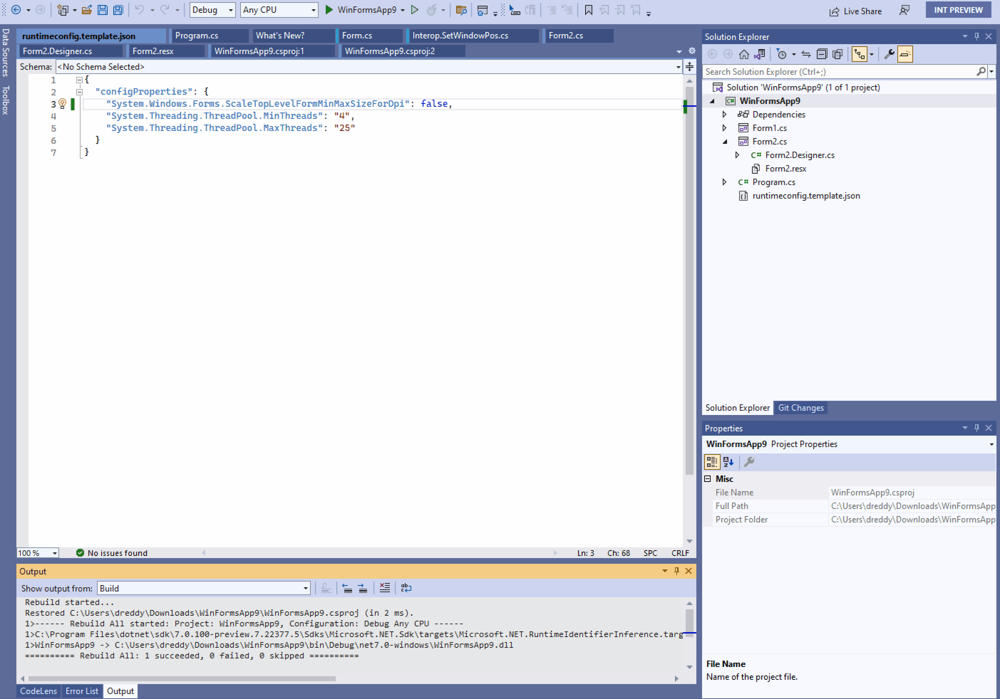

# Support for application runtime configuration in WinForms applications

## Overview
\
NET Winforms applications currently have [limited application
configurations](https://aka.ms/applicationconfiguration) capabilities that are defined via MSBuils properties and are emitted into source code using source
generators at compile time. This document outlines expansion of those application-wide configurations further to cover runtime config options for .NET Windows Forms applications.

## Runtime configuration in .NET Framework applications
\
.NET Framework Windows Forms applications use app.config to define runtime configurations and application-wide settings. Following are the various sections in the app.config that define application's runtime behavior.

### AppContext switches

These settings are used to opt-in or opt-out of a particular feature from WinForms runtime. Please refer to the [AppContext Switches](https://docs.microsoft.com/dotnet/framework/configure-apps/file-schema/runtime/appcontextswitchoverrides-element) documentation for more information

```XML
<configuration>
   <runtime>
      <AppContextSwitchOverrides value="Switch.System.Globalization.NoAsyncCurrentCulture=true" />
   </runtime>
</configuration>
```
### System.Windows.Forms.ApplicationConfigurationSection

This was introduced in .NET Framework 4.7 and is primarily used by Winforms runtime to enable high Dpi and other accessibility improvements. Please refer to the [ApplicationConfigurationSection](https://docs.microsoft.com/dotnet/framework/configure-apps/file-schema/winforms/windows-forms-add-configuration-element) documentation for more information.

```XML
<configuration>
  <System.Windows.Forms.ApplicationConfigurationSection>
  ...
  </System.Windows.Forms.ApplicationConfigurationSection>
</configuration>
```

### App settings from Settings designer/editor page

Unlike above, these settings are used by the user application. These are commonly defined via the Settings designer in Visual Studio, which intern serialize them into the app.config file. Please refer to the [Application Settings](https://docs.microsoft.com/dotnet/desktop/winforms/advanced/using-application-settings-and-user-settings?view=netframeworkdesktop-4.8) documentation for more information.
```XML
 <userSettings>
        <WinFormsApp2.Properties.Settings>
            <setting name="Settingdfsd" serializeAs="String">
                <value>dfds</value>
            </setting>
        </WinFormsApp2.Properties.Settings>
    </userSettings>
    <applicationSettings>
        <WinFormsApp2.Properties.Settings>
            <setting name="dfsd" serializeAs="String">
                <value>sdfsdgs</value>
            </setting>
        </WinFormsApp2.Properties.Settings>
    </applicationSettings>
```


## Winforms runtime configuration in .NET applications
\
app.config has limited support in .NET due to performance and reliability reasons. .NET runtime and other .NET teams use runtimeconfig.json to define .NET runtime configurations and appsettings.json to define application-level settings. In this proposal, we are leveraging runtimeconfig.json to define WinForms runtime configurations.

While this proposal is focusing on providing an alternative solution for existing configuration sections `AppContextSwitchOverrides` and `System.Windows.Forms.ApplicationConfigurationSection` that are primarily used for specifying feature flags impacting winforms runtime behavior, we will be looking into alternatives for `Application Settings` that doesn't require app.config in the upcoming releases of .NET.


### Goals:

-   A replacement for `AppContextSwitchOverrides` and `System.Windows.Forms.ApplicationConfigurationSection` of app.config.
-   Users should be able to update/modify Winforms applications runtime configurations without recompiling the application.
-   The existing applications should be able to seamlessly upgrade to the new configuration model when targeting the latest .NET runtiem.
-   The existing [application configuration MSBuild properties](https://aka.ms/applicationconfiguration) continue to work.

### Out of scope:

 App settings that are serialized by the Settings designer/editor page. Applications should continue to use the current model.
-  Dynamic/real-time (re-)loading of configuration values from runtimeconfig.json.
-  Unification of comple/runtime configurations into one place, runtimeconfig.json.


#### Syntax of runtimeConfig.template.Json.

```xml
{
  "configProperties": {
      "System.Globalization.UseNls": true,
      "System.Net.DisableIPv6": true,
      "System.GC.Concurrent": false,
      "System.Threading.ThreadPool.MinThreads": 4,
      "System.Threading.ThreadPool.MaxThreads": 25
    }
}
```

Windows Forms switches will be added to [`configProperties` section](https://docs.microsoft.com/dotnet/core/runtime-config) with the rest of the .NET switches. To avoid name conflics Windows Forms specific switches will be prefixed with `System.Windows.Forms`:


```xml
{
  "configProperties": {
      "System.Globalization.UseNls": true,
      "System.Net.DisableIPv6": true,
      "System.GC.Concurrent": false,
      "System.Threading.ThreadPool.MinThreads": 4,
      "System.Threading.ThreadPool.MaxThreads": 25,
      
      <!-- Windows Forms specific switches -->
      "System.Windows.Forms.ScaleTopLevelFormMinMaxSize": true,
      "System.Windows.Forms.<CustomEnumProperty>": "EnumValue"
    }
}
```


### Reading Winforms runtime configurations:
\
When a project is [built](https://docs.microsoft.com/en-us/dotnet/core/runtime-config/#runtimeconfigjson), an _[appname].runtimeconfig.json_ file is generated in the output directory. If a _runtimeconfig.template.json_ file exists in the same folder as the project file, any configuration options it contains are inserted into the _[appname].runtimeconfig.json_ file.
This proposal focuses primarily on enabling the runtime configurations for WinForms applications. A support for analyzers and source generators may be considered in the future .NET releases. We will revisit this implementation to improve user-experience further, as we make progress.
For example, the content of _[appname].runtimeconfig.json_ generated from above content:

```XML
{
  "runtimeOptions": {
    "tfm": "net7.0",
    "frameworks": [
      {
        "name": "Microsoft.NETCore.App",
        "version": "7.0.0-preview.7.22375.6"
      },
      {
        "name": "Microsoft.WindowsDesktop.App",
        "version": "7.0.0-preview.7.22377.1"
      }
    ],
    "configProperties": {
      "System.Globalization.UseNls": true,
      "System.Net.DisableIPv6": true,
      "System.GC.Concurrent": false,
      "System.Threading.ThreadPool.MinThreads": 4,
      "System.Threading.ThreadPool.MaxThreads": 25,
      "Switch.System.Windows.Forms.ScaleTopLevelFormMinMaxSize": true,
      "System.Windows.Forms.<StringProperty>": "string"
      "System.Windows.Forms.<CustomProperty>": "CustomValue"
    }
  }
}
```

The target framework information added to _[appname].runtimeconfig.json_ file always match with the application target framework irrespective of runtime/SDK installed on the machine or runtime used ([roll-forward scenarios](https://docs.microsoft.com/dotnet/core/versions/selection#framework-dependent-apps-roll-forward)) by the Windows Forms application.

### .NET runtime support in reading runtimeconfig.json:
\
WinForms is leveraging the [support](https://github.com/dotnet/runtime/blob/5098d45cc1bf9649fab5df21f227da4b80daa084/src/native/corehost/runtime_config.cpp) provided by .NET runtime in reading the _[appname].runtimeconfig.json_ file, and thus get all plumbing required for various hosting and environment scenarios. 
WinForms adds the following wrapper on top of .NET runtime implementation to improve the performance by caching configuration options, and also by defining custom defaults values for the WinForms specific feature flags. This wrapper is very similar to the [.NET runtime's implementation](https://github.com/dotnet/runtime/blob/04dac7b0fede29d44f896c5fd793754f83974175/src/libraries/System.Private.CoreLib/src/System/AppContextConfigHelper.cs).
The below example illustrates how to define `ScaleTopLevelFormMinMaxSizeForDpi` feature flag, opt-in by default, if an application is running on Windows 10 and is targeting .NET 8:

```cs
internal static partial class LocalAppContextSwitches
{
    private static readonly FrameworkName? s_targetFrameworkName = GetTargetFrameworkName();
    private static readonly bool s_isNetCoreApp = (s_targetFrameworkName?.Identifier) == ".NETCoreApp";

    private const string SwitchScaleTopLevelFormMinMaxSizeForDpi = "System.Windows.Forms.ScaleTopLevelFormMinMaxSizeForDpi";
    private static int s_scaleTopLevelFormMinMaxSize;

    public static bool ScaleTopLevelFormMinMaxSize
    {
        [MethodImpl(MethodImplOptions.AggressiveInlining)]
        get => GetCachedSwitchValue(SwitchScaleTopLevelFormMinMaxSizeForDpi, ref s_scaleTopLevelFormMinMaxSize);
    }

    private static FrameworkName? GetTargetFrameworkName()
    {
        string? targetFrameworkName = AppContext.TargetFrameworkName;
        return targetFrameworkName is null ? null : new FrameworkName(targetFrameworkName);
    }

    private static bool GetCachedSwitchValue(string switchName, ref int cachedSwitchValue)
    {
        // The cached switch value has 3 states: 0 - unknown, 1 - true, -1 - false
        if (cachedSwitchValue < 0)
            return false;
        if (cachedSwitchValue > 0)
            return true;

        return GetSwitchValue(switchName, ref cachedSwitchValue);
    }

    private static bool GetSwitchValue(string switchName, ref int cachedSwitchValue)
    {
        bool hasSwitch = AppContext.TryGetSwitch(switchName, out bool isSwitchEnabled);
        if (!hasSwitch)
        {
            isSwitchEnabled = GetSwitchDefaultValue(switchName);
        }

        // Is caching switches disabled?.
        AppContext.TryGetSwitch("TestSwitch.LocalAppContext.DisableCaching", out bool disableCaching);
        if (!disableCaching)
        {
            cachedSwitchValue = isSwitchEnabled ? 1 /*true*/ : -1 /*false*/;
        }

        return isSwitchEnabled;
    }

    // Provides default values for switches based on OS and Targetframework versions.
    private static bool GetSwitchDefaultValue(string switchName)
    {
        if (!s_isNetCoreApp)
        {
            return false;
        }

        if (OsVersion.IsWindows10_1703OrGreater)
        {
            if (s_targetFrameworkName!.Version.CompareTo(new Version("8.0")) >= 0)
            {
                if (switchName == SwitchScaleTopLevelFormMinMaxSizeForDpi)
                {
                    return true;
                }
            }
        }

        return false;
    }
}
```


WinForms runtime then uses the static `LocalAppContextSwitches` class to access the runtime configurations. The below sample demonstrates how to access the feature switch `Switch.System.Windows.Forms.ScaleTopLevelFormMinMaxSize`:

Ex: Use of feature switch in ScaleContainerForDpi() method in ContainerControl.cs to scale Min/Max size of the Container.

```cs
internal void ScaleContainerForDpi(int deviceDpiNew, int deviceDpiOld, Rectangle suggestedRectangle)
{
    CommonProperties.xClearAllPreferredSizeCaches(this);
    SuspendAllLayout(this);
    try
    {
        if (LocalAppContextSwitches.ScaleTopLevelFormMinMaxSize)
        {
            // The suggested rectangle comes from Windows, and it does not match with our calculations for scaling controls by AutoscaleFactor.
            // Hence, we cannot use AutoscaleFactor here for scaling the control properties. See the below description for more details.
            float xScaleFactor = (float)suggestedRectangle.Width / Width;
            float yScaleFactor = (float)suggestedRectangle.Height / Height;
            ScaleMinMaxSize(xScaleFactor, yScaleFactor, updateFormSize: false);
        }

        // If this container is a top-level window, we would receive WM_DPICHANGED message that
        // has SuggestedRectangle for the control. We are forced to use this in such cases to
        // make the control placed in right location with respect to the new monitor that triggered
        // WM_DPICHANGED event. Failing to apply SuggestedRectangle will result in a circular WM_DPICHANGED
        // events on the control.

        // Note: SuggestedRectangle supplied  by WM_DPICHANGED event is Dpi (not Font) scaled. if top-level window is
        // Font scaled, we might see deviations in the expected bounds and may result in adding Scrollbars (horizontal/vertical)
        User32.SetWindowPos(
            new HandleRef(this, HandleInternal),
            User32.HWND_TOP,
            suggestedRectangle.X,
            suggestedRectangle.Y,
            suggestedRectangle.Width,
            suggestedRectangle.Height,
            User32.SWP.NOZORDER | User32.SWP.NOACTIVATE);

        // Bounds are already scaled for the top-level window. We would need to skip scaling of
        // this control further by the 'OnFontChanged' event.
        _isScaledByDpiChangedEvent = true;

        // Factor is used only to scale Font. After that AutoscaleFactor kicks in to scale controls.
        var factor = ((float)deviceDpiNew) / deviceDpiOld;

        // DpiFontscache is available only in PermonitorV2 mode applications.
        if (!TryGetDpiFont(deviceDpiNew, out Font? fontForDpi))
        {
            Font currentFont = Font;
            fontForDpi = currentFont.WithSize(currentFont.Size * factor);
            AddToDpiFonts(deviceDpiNew, fontForDpi);
        }

        ScaledControlFont = fontForDpi;
        if (IsFontSet())
        {
            SetScaledFont(fontForDpi);
        }
        else
        {
            using (new LayoutTransaction(ParentInternal, this, PropertyNames.Font))
            {
                OnFontChanged(EventArgs.Empty);
            }
        }
    }
    finally
    {
        // We want to perform layout for dpi-changed high Dpi improvements - setting the second parameter to 'true'
        ResumeAllLayout(this, true);
        _isScaledByDpiChangedEvent = false;
    }
}
```

