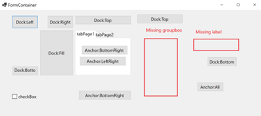
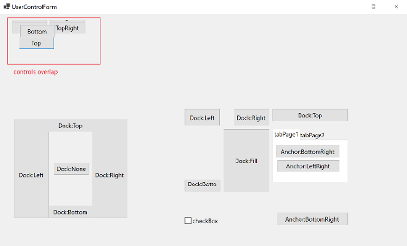
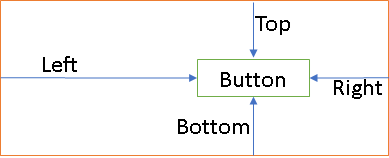

# Anchor layout changes in .NET 8.0


## Description

We have multiple [issues](https://github.com/dotnet/winforms/issues?q=is%3Aissue+is%3Aopen+anchor+label%3A%22area%3A+anchor%2Fscaling%22) reported in WinForms around the anchor layout being problematic on higher DPI scale monitors, irrespective of application DPI mode. This document outlines the changes being made in .NET 8.0 to address these issues, which is aligned with the larger goal to support all supported application DPI modes in WinForms.

## Problem in Scope

The position of an anchored control with respect to its parent should be able to be determined at design time and should only need to be changed if there were explicit changes in the control's bounds or when the control is scaled in response to a DPI changed event. Bounds changes that happen as result of the parent control's bounds changing shouldn't alter a control's relative position in the parent's rectangle. However, currently the layout engine computes the anchored control's relative position every time there are changes to the control's bounds or the control's location-related properties.

For example, the following simple code snippet copied from a Control's `InitializeComponent` method demonstrates the impact of the "over-eager" computations. The number of unnecessary computations can increase quite dramatically for nested layouts.

```CS
// The following line triggers layout to compute anchors with the default button size and without a parent control.
this.button7.Anchor = ((System.Windows.Forms.AnchorStyles)((System.Windows.Forms.AnchorStyles.Left | System.Windows.Forms.AnchorStyles.Right)));

// The following line triggers layout again to compute anchors with the default button size with a new location but still without a parent control.
this.button7.Location = new System.Drawing.Point(9, 47);

// The following line triggers layout once again to compute anchors with the button's new size but still without a parent control.
this.button7.Size = new System.Drawing.Size(134, 23);

// The following line triggers layout to compute anchors with button's current size and the default size for the parent control.
this.Controls.Add(button7);

// The following line triggers layout to compute anchors with the button's current size and a new size for the parent control.
// These sizes still may be changed for the current DPI depending on application's DPI mode.
this.Size = new System.Drawing.Size(828, 146);

// The following line triggers layout to compute anchors with the button's current size and new size for the parent control.
// The current DPI is still not applied.
this.ResumeLayout(false);
```
The above snippet does not represent the complete set of instances where anchor computations are unnecessary and may hold invalid anchor values. It gets even more complicated when nested UserControls are involved.

In addition, the original anchor calculation implementation was designed prior to adding high DPI support to WinForms.

## Known issues

Customer reported issues can be largely grouped as follows:


### Missing controls

Calculation of control's anchors with default sizes may result in negative anchors and, thus, result in an invalid location for the anchored controls.




### Overlapped Controls

Related to the "Missing controls" issue above, if the parent control is scaled to match the current monitor's DPI, and the control's anchor calculations happen out of sync with this scaling, controls may overlap:




## Proposed solution

 The proposal is that we calculate anchors for a control only if the following conditions are met:

- The control is parented.
- The control's parent's layout is resumed.

 The initial anchor calculations would now happen whenever parent's layout is resumed, or when control is parented/resized and parent's layout is not suspended. The anchors will be recalculated whenever there are changes in geometry (`Size`, `Location`, etc.) or hierarchy (`ParentChanged`).

### Anchor calculations

The following image illustrates anchors calculation with respect to a control's parent's display rectangle. The "orange" rectangle is the parent's display rectangle, and the "blue" rectangle is the anchored control's (button) bounds.
- `Left` arrow indicates the X coordinate of the button location with respect to the parent's display rectangle.
- `Top` arrow indicates the Y coordinate of the button location with respect to the parent's display rectangle.
- `Right` arrow indicates the distance from right edge of the parent's rectangle where button is placed.
- `Right` arrow indicates the distance from the bottom edge of the parent's rectangle where the button is placed.

    


In the above image the boundary marked in "orange" is a container hosting the control (boundary marked with "blue"). The control can define its anchor property to explicitly tell the layout engine how its bounds change relative to its parent's bounds.

For example:
```CS
this.button14.Anchor = (System.Windows.Forms.AnchorStyles.Bottom
 | System.Windows.Forms.AnchorStyles.Left
 | System.Windows.Forms.AnchorStyles.Top
 | System.Windows.Forms.AnchorStyles.Right );
```
When the control's `Anchor` property is set, the anchors (that is, left, top, right, bottom values) are computed and stored in an internal struct `AnchorInfo`. The only time the anchor values can be negative is when the control is placed/position outside/overlapped with the hosting control's bounds.

The following code snippet demonstrates anchor calculations:

```CS
private static void ComputeAnchorInfo(IArrangedElement element)
{
    AnchorInfo? anchorInfo = GetAnchorInfo(element);
    if (anchorInfo is null)
    {
        anchorInfo = new();
        SetAnchorInfo(element, anchorInfo);
    }
    Rectangle displayRect = element.Container.DisplayRectangle;
    Rectangle elementBounds = GetCachedBounds(element);
    int x = elementBounds.X;
    int y = elementBounds.Y;
    anchorInfo.Left = x;
    anchorInfo.Top = y;
    anchorInfo.Right = displayRect.Width - (x + elementBounds.Width);
    anchorInfo.Bottom = displayRect.Height - (y + elementBounds.Height);
}
```

## Risk mitigation

The layout engine, in general, is quite complex, and any changes in it carry a very high risk. In order to reduce the risks and to provide backward compatibility, the new anchor calculations are put behind a feature switch `System.Windows.Forms.AnchorLayoutV2`. The switch is disabled by default for Windows Forms applications.

Developers need to opt-in to get this new feature by setting the switch value to `true` in the [runtimeconfig.json](https://learn.microsoft.com/dotnet/core/runtime-config/#runtimeconfigjson).
Snippet for runtimeconfig.template.json:
```JSON
{
  "configProperties": {
    "System.Windows.Forms.AnchorLayoutV2": true
  }
}
```


