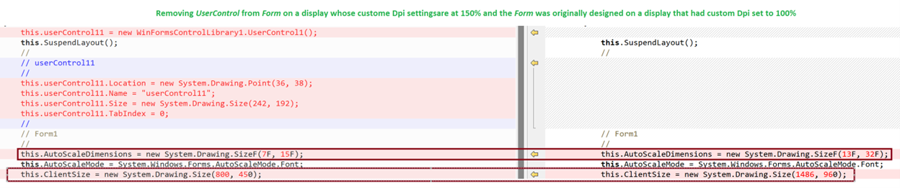

# Designer HighDpi mode
Visual Studio 2022 and beyond by default launch in PerMonitor DpiAwareness mode but it also supports SystemAware and Unaware DpiAwareness modes when users launch it with [custom settings](https://docs.microsoft.com/visualstudio/designers/disable-dpi-awareness?view=vs-2022). The WinForms designer does not fully support PerMonitor DpiAwareness mode yet and by default launches in SystemAware mode.

In .NET 6, as part of unifying the information sharing between WinForms designer and WinForms runtime, we added [support](https://aka.ms/applicationconfiguration) for specifying the application dpi mode as a build time property on the project and share it for both designtime and at runtime.

## Issues
 The Winforms designer, when operating in SystemAware/PermonitorV2 mode, serializes layout metrics into the source file based on the Dpi setting of the current display device on which it is being rendered. This may lead to two kinds of problems.

 1. WinForms applications developed on a machine with DPI settings different from the machine where they are executed may encounter layout inconsistencies. 
 
 2. Within a team of multiple developers collaborating on the same project, this situation can lead to unintentional modifications in the serialized source code, even if they are unrelated to the intended changes. As a consequence, it introduces additional overhead in the code review and merging process.

The following example demonstrates an undesired modification in the serialized WinForms source code.




Up until now, developers have been advised to adhere to the instructions given [here](https://go.microsoft.com/fwlink/?linkid=875609) and restart Visual Studio in DpiUnAware mode to resolve these problems. Nevertheless, this process requires individual developers to do it every time they work on the project, adding inconvenience. Additionally, the entire Visual Studio IDE would be launched as DPI Unaware resulting in a blurry IDE experience.

## Solution

In Visual Studio 2022 Version 17.8, we are introducing a new [configuration]((https://aka.ms/applicationconfiguration)) option called `ForceDesignerDpiUnaware`, distinct from `ApplicationHighDpiMode`. This option enables developers to enforce DpiUnAware mode for all WinForms designers in the project, regardless of the `ApplicationHighDpiMode`, which continues to take effect during runtime. The rest of the Visual Studio environment remains in PerMonitor mode and renders crisply.


```xml
 <Project Sdk="Microsoft.NET.Sdk">
  <PropertyGroup>
    <OutputType>WinExe</OutputType>
    <TargetFramework>net7.0-windows</TargetFramework>
    <Nullable>enable</Nullable>
    <UseWindowsForms>true</UseWindowsForms>
    <ImplicitUsings>enable</ImplicitUsings>
    <ApplicationHighDpiMode>SystemAware</ApplicationHighDpiMode>
    <ForceDesignerDpiUnaware>true</ForceDesignerDpiUnaware>
  </PropertyGroup>
```
