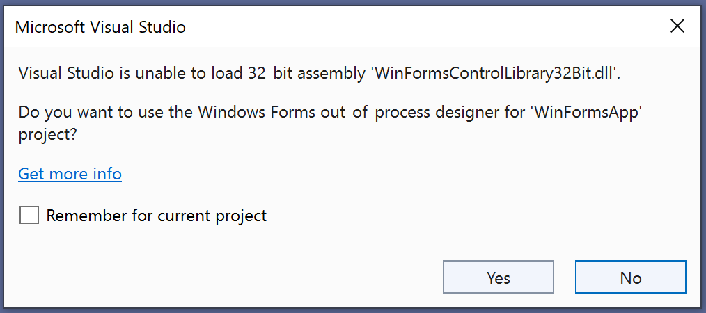

# Designer Selection Feature for .NET Framework Projects

## Problem
`Visual Studio 2022` is a 64-bit process and it cannot load 32-bit assemblies. Due to this technical limitation, `Windows Forms in-process designer`, which runs in the `Visual Studio` process, cannot load controls present in 32-bit assemblies.
This has been a major `Visual Studio 2022` adoption blocker for customers who have Windows Forms .NET Framework projects which utilize `ActiveX/COM` controls or other custom controls contained in 32-bit assemblies and which cannot be updated to `AnyCPU` or to `.NET`. Till now, such projects could only use Windows Forms designer in `Visual Studio 2019` because it is a 32-bit process.

## Solution
To address this problem, we have been adding support for .NET Framework projects in Windows Forms **out-of-process** designer in last few `Visual Studio 2022` releases. 
Although we are not there yet, the latest `Visual Studio 17.9 Preview 2` release is worth a try. This release contains improved `Type Resolution` support for .NET Framework projects and `ActiveX/COM` support for both .NET Framework and .NET projects. This release also adds **Designer Selection Feature** which tracks 32-bit assembly load failures in Windows Forms .NET Framework projects and if a failure is detected, it presents following dialog to the user to select appropriate designer for the project.



On selecting `Yes`, the project will be reloaded and Windows Forms out-of-process designer will be used for the project. The out-of-process designer will spawn appropriate 32-bit or 64-bit process `FxDesignToolsServer.exe` depending upon project target platform and will load control assemblies in that process.
On selecting `No`, the project will continue to use in-process designer.

With `Yes/No` buttons, the designer selection will be remembered for current `Visual Studio` instance only. To add the designer selection as a project configuration property automatically, enable option `Remember for current project`. It will add `UseWinFormsOutOfProcDesigner` property to each project configuration. Windows Forms designer will read this property value to select desired designer automatically the next time project is open in `Visual Studio`. Here is a sample project configuration after adding this property:

```
  <PropertyGroup Condition="'$(Configuration)|$(Platform)' == 'Debug|x86'">
    <OutputPath>bin\x86\Debug\</OutputPath>
    <DebugType>full</DebugType>
    <PlatformTarget>x86</PlatformTarget>
    <Prefer32Bit>true</Prefer32Bit>
        <UseWinFormsOutOfProcDesigner>True</UseWinFormsOutOfProcDesigner>
  </PropertyGroup>
```

This feature will solve the cases of forms having controls that have modern designers, i.e., the ones referencing the new out-of-process designer [SDK](https://www.nuget.org/packages/Microsoft.WinForms.Designer.SDK) or some simple controls which do not use complex designer features. However, this feature will not work for forms with controls that use complex designer features and as a result they must be updated to use [out-of-process designer extensibility](https://github.com/microsoft/winforms-designer-extensibility) model.

Note that the `Designer Selection` feature is currently under following preview feature flag which is enabled by default:


This feature flag is present in Visual Studio IDE under `Tools -> Options -> Preview Features`.

Following InfoBar will show up when out-of-process designer is used for .NET Framework projects:


## :warning: Warning
Since the out-of-process designer for .NET Framework projects, cannot handle all third-party controls, there is a possibility of data loss on using this feature. Hence we recommend that you create a backup of your project beforehand.
Also, there is a difference in the way CodeDom parsing is handled between in-process and out-of-process designers. The out-of-process designer will likely make significant updates to the code behind file which might make it incompatible with in-process designer. This issue will be addressed in an upcoming release.

## Next Steps
Following are the list of features which we plan to add support for in upcoming Visual Studio releases:

1. Disable code style and formatting changes due to RoslynCodeDomService for .NET Framework projects utilizing out-of-process designer.
2. Add Toolbox support for third-party and custom controls.
3. Add setting for `UseWinFormsOutOfProcDesigner` property in project property pages.
