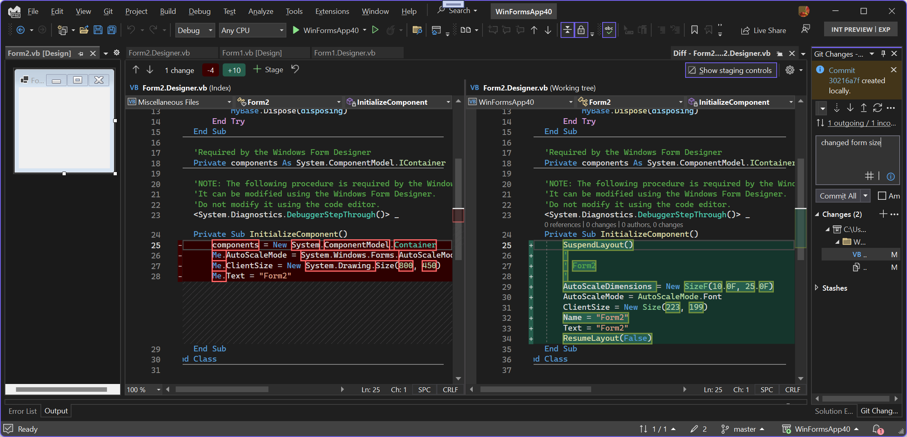

# Modernization of WinForms code behind in Out-of-Process WinForms designer

WinForms designer saves visual representations of user controls or forms on the designer surface to code behind file(Form1.designer.cs or Form1.designer.vb). Control instances that developer sees on the design surface are represented as a CodeDOM tree ([Using the CodeDOM - .NET Framework | Microsoft Learn](https://learn.microsoft.com/dotnet/framework/reflection-and-codedom/using-the-codedom)), that tree is saved to the generated code behind file. We call this feature design time serialization.

Up until Visual Studio 2022 v17.5 Preview 3,  COM-based CodeModel interfaces ([CodeModel Interface (EnvDTE) | Microsoft Learn](https://learn.microsoft.com/dotnet/api/envdte.codemodel?view=visualstudiosdk-2022)) were used to write code into the editor's buffer as well as to generate CodeDOM from the source code when designer was loading.  This COM object was accessible from the main thread only, and prevented parallelization in source code processing. Also it did not support some of the newer language features, for example the `nameof()` expression. We are planning to build upon this foundation in the future releases. Code behind generated by the older releases can be loaded into Preview 3 or later and will work as expected. Code behind generated by Preview 3 can be loaded in the previous releases of the Visual Studio, but we are considering generating newer languages features that are not supported by the previous versions.  

Starting with [Visual Studio 2022 v17.5 Preview 3](microsoft.com)](<https://visualstudio.microsoft.com/vs/preview/>), WinForms Out of Process Designer uses [Roslyn](https://github.com/dotnet/roslyn) for design time serialization.

## Wins

* The use of Roslyn unblocks multithreaded serialization and deserialization to solve performance delays in designer load and unload scenarios.
* Code behind generation now respects `.editorconfig` settings and thus matches code style in the source files.
* If developer enables implicit usings feature in the project properties, this option is respected by the code generation.
* Further modernization of code in .designer files is unblocked now.
* Newly generated code be compatible with modern Roslyn analyzers.

## Expected code-behind changes after the first design time serialization

While `InitializeComponent` method is meant for the designer use only, and we don't support manual modifications to this method, you might see some changes in Form1.designer.cs and Form1.designer.vb  files in the source control tools. We have a one-time solution for this code churn.

For example, you will see changes to code behind in the new projects, until we update the templates. When a new WinForms application targeting .NET 8.0 is created, its `InitializeComponent` method looks like this:

```cs
private void InitializeComponent()
{
    this.components = new System.ComponentModel.Container();
    this.AutoScaleMode = System.Windows.Forms.AutoScaleMode.Font;
    this.ClientSize = new System.Drawing.Size(800, 450);
    this.Text = "Form1";
}
```

.

Note that source code uses `this` access qualifier(`this.components`) as well as namespace-qualified type(`System.ComponentModel.Container();`) names. The namespace names are present because `using` directives were not generated in the past and design time serialization didn't not read [implicit usings](https://www.hanselman.com/blog/implicit-usings-in-net-6) property, available in .NET 6.0 for C#, and always for VB, from the project file:

```xml
<Project Sdk="Microsoft.NET.Sdk">

  <PropertyGroup>
    <OutputType>WinExe</OutputType>
    <TargetFramework>net8.0-windows</TargetFramework>
    <Nullable>enable</Nullable>
    <UseWindowsForms>true</UseWindowsForms>
    <ImplicitUsings>enable</ImplicitUsings>
  </PropertyGroup>

</Project>
```

As soon as you save changes, for example, add a button, and click File->Save Form1.cs, code is re-generated:

```cs
private void InitializeComponent()
{
    button1 = new Button();
    SuspendLayout();
    // 
    // button1
    // 
    button1.Location = new Point(25, 32);
    button1.Name = "button1";
    button1.Size = new Size(75, 23);
    button1.TabIndex = 0;
    button1.Text = "button1";
    button1.UseVisualStyleBackColor = true;
    // 
    // Form1
    // 
    AutoScaleDimensions = new SizeF(7F, 15F);
    AutoScaleMode = AutoScaleMode.Font;
    ClientSize = new Size(163, 158);
    Controls.Add(button1);
    Name = "Form1";
    Text = "Form1";
    ResumeLayout(false);
}
```


Changes in `InitializeComponents`

* `this` access qualifier is removed, because I used default style settings in my Visual Studio, and the default is to omit `this`. Other `Code Style` preferences will be applied as well.
* Namespace names are removed from the type names. Namespaces are not needed because implicit usings are enabled for this project and the relevant namespaces are already referenced.
* Initialization for an unused field(`components`) is removed!

To control code style, like presence of access qualifiers, edit `.editorconfig` file:

```ini
# C# files
[*.cs]

# this. and Me. preferences
dotnet_style_qualification_for_event = false
dotnet_style_qualification_for_field = false
dotnet_style_qualification_for_method = false
dotnet_style_qualification_for_property = false
```

Settings can be also modified in the Visual Studio, go to Tools->Options menu (Alt+T; O), select Text Editor-> C# -> Code Style, and define your preferences:


Read more about editor settings [here](https://learn.microsoft.com/visualstudio/ide/create-portable-custom-editor-options?view=vs-2022).

To generate namespace names, you can disable `implicit usings` property in the project file, however that would affect source code in all files.

You will see similar updates in the VB projects. To demonstrate them, I created a new VB WinForms project targeting .NET 8, and changed form size in the designer. `InitializeComponent`, before the change, uses `Me` qualifier and namespace names.

```vb
<System.Diagnostics.DebuggerStepThrough()> _
    Private Sub InitializeComponent()
        components = New System.ComponentModel.Container
        Me.AutoScaleMode = System.Windows.Forms.AutoScaleMode.Font
        Me.ClientSize = New System.Drawing.Size(800, 450)
        Me.Text = "Form2"
    End Sub
```

After the resize change is saved, code is re-generated :

```vb
 <System.Diagnostics.DebuggerStepThrough()> _
    Private Sub InitializeComponent()
        SuspendLayout()
        ' 
        ' Form2
        ' 
        AutoScaleDimensions = New SizeF(10.0F, 25.0F)
        AutoScaleMode = AutoScaleMode.Font
        ClientSize = New Size(223, 199)
        Name = "Form2"
        Text = "Form2"
        ResumeLayout(False)
    End Sub
```



Code style, for example, `Me.` qualifier, is controlled by .`editorconfig`, the same values, but under the VB language header.

```ini
# Visual Basic files
[*.vb]

# this. and Me. preferences
dotnet_style_qualification_for_event = true
dotnet_style_qualification_for_field = true
dotnet_style_qualification_for_method = true
dotnet_style_qualification_for_property = true
```

But presence of namespace names is controlled in the project properties differently. And can't be fully compatible with the previously generated code.The default set of namespace names for WinForms applications is omitted from the project file. `ImportedNamespaces` property is added to the project file only after the set is modified.

```xml
  <PropertyGroup>
    <OutputType>WinExe</OutputType>
    <TargetFramework>net8.0-windows</TargetFramework>
    <StartupObject>Sub Main</StartupObject>
    <UseWindowsForms>true</UseWindowsForms>
    <MyType>WindowsForms</MyType>
    <ImportedNamespaces>System.Data=False,System.Drawing=False;System.Windows.Forms=False,Microsoft.VisualBasic=True,System=True,System.Collections=True,System.Collections.Generic=True,System.Diagnostics=True,System.Linq=True,System.Xml.Linq=True,System.Threading.Tasks=True,WinFormsApp40=True</ImportedNamespaces>
  </PropertyGroup>
```

This set should be edited in the Visual Studio only, select application name in solution explorer, right click on it and select properties (Alt+Enter). Then select References->General tab. When `System.Drawing` namespace is unchecked in this page, designer will generate partial namespace name, `Drawing`. `System` namespace is always referenced, so it is omitted from the type name in the new designer.


Similarly, generated code will change when the same project is opened and modified by different versions of the Visual Studio. The new generated code can be opened by the previous version of the designer. To keep code style consistent between different version of the Visual Studio, update the `.editorconfig` file, however, we recommend upgrading environment to the latest.
