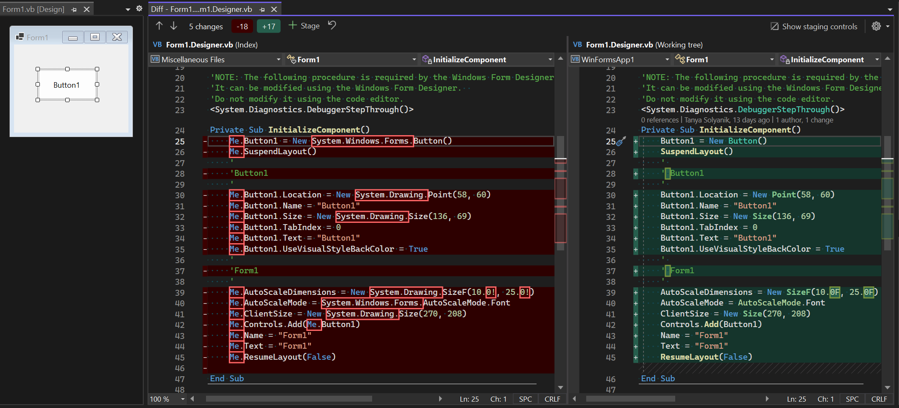

# Modernization of code-behind in WinForms OOP designer

## Background

The WinForms designer saves visual representations of user controls or forms on the design surface to code-behind file (`Form1.Designer.cs` or `Form1.Designer.vb`). Control instances that developer sees on the design surface are represented as a CodeDOM tree (see [Using the CodeDOM](https://learn.microsoft.com/dotnet/framework/reflection-and-codedom/using-the-codedom)), that tree is saved to the generated code-behind file in the `InitializeComponent` method. We call this feature design time serialization.

Previously COM-based [CodeModel interface](https://learn.microsoft.com/dotnet/api/envdte.codemodel?view=visualstudiosdk-2022) was used to write code into the editor's buffer as well as to generate CodeDOM tree from the source code when designer was loading. This COM object was accessible from the main thread only, which prevented parallelization in source code processing. Also, being more than 20 years old, it did not support some of the newer language features, for example the `nameof()` expression.

## What's different

Starting with [Visual Studio 2022 v17.5 Preview 3](https://visualstudio.microsoft.com/vs/preview/), the WinForms out-of-process designer uses [Roslyn](https://github.com/dotnet/roslyn) for design time serialization.

In Preview 3, designer serializes more modern code into `InitializeComponent`. We have worked hard to ensure that you can take projects between this version of Visual Studio and earlier versions. Someday in the future, we may build on the improvements in our serialization to enable performance enhancements and use newer language features. These potential future investments may break the backwards compatibility with earlier VS versions - but we will be sure to inform our developers well ahead of such changes so that you can prepare.

## Why change it

* The use of Roslyn unblocks multithreaded serialization and deserialization to solve performance delays in designer load and unload scenarios.
* Code-behind generation now respects `.editorconfig` settings and thus matches code style in the source files.
* If implicit usings feature is enabled in project properties, global namespaces are not repeated in type names.
* Further modernization of code-behind is unblocked.
* Newly generated code will work with modern Roslyn analyzers.

## How the new code looks like

While `InitializeComponent` method is meant for the designer use only, and manual modifications to this method are not supported, developers might see some unexpected changes in `Form1.Designer.cs` and `Form1.designer.vb` files when comparing versions in the source control tools. This is a one-time code churn. Once the designer file is regenerated in v17.5 Preview 3 or newer and saved, designer will generate code only for controls modified in the design surface.

For example, `InitializeComponent` method for a form with a button will be modified like this on the first save:


Code generated by VisualStudio v17.4 or earlier:

```cs
private void InitializeComponent()
{
    this.button1 = new System.Windows.Forms.Button();
    this.SuspendLayout();
    // 
    // button1
    // 
    this.button1.Location = new System.Drawing.Point(58, 60);
    this.button1.Name = "button1";
    this.button1.Size = new System.Drawing.Size(136, 69);
    this.button1.TabIndex = 0;
    this.button1.Text = "button1";
    this.button1.UseVisualStyleBackColor = true;
    // 
    // Form1
    // 
    this.AutoScaleDimensions = new System.Drawing.SizeF(10F, 25F);
    this.AutoScaleMode = System.Windows.Forms.AutoScaleMode.Font;
    this.ClientSize = new System.Drawing.Size(270, 208);
    this.Controls.Add(this.button1);
    this.Name = "Form1";
    this.Text = "Form1";
    this.ResumeLayout(false);

}
```

Code generated by VisualStudio v17.5 Preview 3, or newer:

```cs
private void InitializeComponent()
{
    button1 = new Button();
    SuspendLayout();
    // 
    // button1
    // 
    button1.Location = new Point(58, 60);
    button1.Name = "button1";
    button1.Size = new Size(136, 69);
    button1.TabIndex = 0;
    button1.Text = "button1";
    button1.UseVisualStyleBackColor = true;
    // 
    // Form1
    // 
    AutoScaleDimensions = new SizeF(10F, 25F);
    AutoScaleMode = AutoScaleMode.Font;
    ClientSize = new Size(270, 208);
    Controls.Add(button1);
    Name = "Form1";
    Text = "Form1";
    ResumeLayout(false);
}
```

### Support for code style settings

The above code was generated for default C# code style settings, thus `this` access qualifier was removed in the Preview 3 version.

To preserve legacy code generation style in `InitializeComponent` method, set style preferences to legacy values in [`.editorconfig` file](https://learn.microsoft.com/visualstudio/ide/create-portable-custom-editor-options).

```ini
[*.designer.cs]

# this. preferences
dotnet_style_qualification_for_event = true
dotnet_style_qualification_for_field = true
dotnet_style_qualification_for_method = true
dotnet_style_qualification_for_property = true

[*.vb]

# Me. preferences
dotnet_style_qualification_for_event = true
dotnet_style_qualification_for_field = true
dotnet_style_qualification_for_method = true
dotnet_style_qualification_for_property = true
```

### Support for implicit usings property

Namespace names were removed from the type names in Preview 3 version. They are not needed for type resolution because design time serialization looks up the [implicit usings](https://learn.microsoft.com/dotnet/core/tutorials/top-level-templates#implicit-using-directives) property, available in C# starting with .NET 6 for C#, from the project file:

```xml
<Project Sdk="Microsoft.NET.Sdk">

  <PropertyGroup>
    <OutputType>WinExe</OutputType>
    <TargetFramework>net8.0-windows</TargetFramework>
    <Nullable>enable</Nullable>
    <UseWindowsForms>true</UseWindowsForms>
    <ImplicitUsings>enable</ImplicitUsings>
  </PropertyGroup>

</Project>
```

When implicit usings property is disabled in the C# project file, namespace names are generated.

### Similar changes are present in Visual Basic



Code generated by VisualStudio v17.4 or earlier:

```vb
<System.Diagnostics.DebuggerStepThrough()>
Private Sub InitializeComponent()
    Me.Button1 = New System.Windows.Forms.Button()
    Me.SuspendLayout()
    '
    'Button1
    '
    Me.Button1.Location = New System.Drawing.Point(58, 60)
    Me.Button1.Name = "Button1"
    Me.Button1.Size = New System.Drawing.Size(136, 69)
    Me.Button1.TabIndex = 0
    Me.Button1.Text = "Button1"
    Me.Button1.UseVisualStyleBackColor = True
    '
    'Form1
    '
    Me.AutoScaleDimensions = New System.Drawing.SizeF(10.0!, 25.0!)
    Me.AutoScaleMode = System.Windows.Forms.AutoScaleMode.Font
    Me.ClientSize = New System.Drawing.Size(270, 208)
    Me.Controls.Add(Me.Button1)
    Me.Name = "Form1"
    Me.Text = "Form1"
    Me.ResumeLayout(False)

End Sub
```

Code generated by VisualStudio v17.5 Preview 3, or newer:

```vb
<System.Diagnostics.DebuggerStepThrough()>
Private Sub InitializeComponent()
    Button1 = New Button()
    SuspendLayout()
    ' 
    ' Button1
    ' 
    Button1.Location = New Point(58, 60)
    Button1.Name = "Button1"
    Button1.Size = New Size(136, 69)
    Button1.TabIndex = 0
    Button1.Text = "Button1"
    Button1.UseVisualStyleBackColor = True
    ' 
    ' Form1
    ' 
    AutoScaleDimensions = New SizeF(10.0F, 25.0F)
    AutoScaleMode = AutoScaleMode.Font
    ClientSize = New Size(270, 208)
    Controls.Add(Button1)
    Name = "Form1"
    Text = "Form1"
    ResumeLayout(False)
End Sub
```

## Summary

New code-behind in WinForm apps looks differently because it follows code style settings defined for the project. Under the covers, the design time serialization was redesigned in order to move from `EnvDTE.CodeModel` to `Roslyn`. We are planning to build upon this foundation in the future Visual Studio releases. Code-behind generated by the older releases will load into v17.5 Preview 3 or later releases and will work as expected. Code-behind generated by v17.5 Preview 3 can be loaded in the previous releases of the Visual Studio, but we are considering generating modern code that might not be supported by the previous versions of deserializer.
