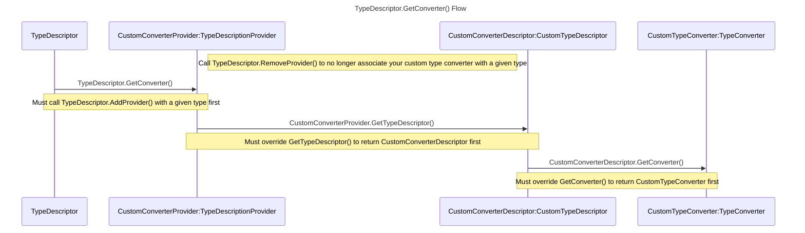

# Manually Registering a TypeConverter to a Class
A [type converter](https://learn.microsoft.com/dotnet/api/system.componentmodel.typeconverter) is usually bound to a class by adding the [`TypeConverterAttribute`](https://learn.microsoft.com/dotnet/api/system.componentmodel.typeconverterattribute) to the class. When you cannot apply this attribute or want to override it you can programmatically assign a converter instead. This document outlines how to accomplish this.

## Prerequisite
Follow the steps to implement your own custom type converter listed [here](https://learn.microsoft.com/dotnet/api/system.componentmodel.typeconverter#notes-to-inheritors).

## Registering Your TypeConverter

### Background
A [`TypeConverter`](https://learn.microsoft.com/dotnet/api/system.componentmodel.typeconverter) for a given type is found via the `TypeDescriptor` static method [`GetConverter()`](https://learn.microsoft.com/dotnet/api/system.componentmodel.typedescriptor.getconverter). To provide custom `TypeDescriptor` behavior you must create and register a custom type descriptor ([`ICustomTypeDescriptor`](https://learn.microsoft.com/dotnet/api/system.componentmodel.icustomtypedescriptor)) via a [`TypeDescriptionProvider`](https://learn.microsoft.com/dotnet/api/system.componentmodel.typedescriptionprovider).

### Implementing An ICustomTypeDescriptor
Inherit from [`CustomTypeDescriptor`](https://learn.microsoft.com/dotnet/api/system.componentmodel.customtypedescriptor) to get default [`ICustomTypeDescriptor`](https://learn.microsoft.com/dotnet/api/system.componentmodel.icustomtypedescriptor) behavior and override [`GetConverter()`](https://learn.microsoft.com/dotnet/api/system.componentmodel.customtypedescriptor.getconverter) to return your custom type converter.
```c#
private class CustomConverterDescriptor : CustomTypeDescriptor
{
    private TypeConverter _converter;

    public CustomConverterDescriptor(ICustomTypeDescriptor parent, TypeConverter converter) : base(parent)
        => _converter = converter;

    public override TypeConverter GetConverter() => _converter;
}
```

An `ICustomTypeDescriptor` is accessed through [`TypeDescriptionProvider.GetTypeDescriptor()`](https://learn.microsoft.com/dotnet/api/system.componentmodel.typedescriptionprovider.gettypedescriptor). This method needs to be overridden to provide your newly created `ICustomTypeDescriptor`. Have another class inherit from `TypeDescriptionProvider` to preserve the default behavior and override `GetTypeDescriptor()` to provide `CustomConverterDescriptor`.

```c#
public class CustomConverterProvider : TypeDescriptionProvider
{
    private TypeConverter _converter;

    public CustomConverterProvider(TypeDescriptionProvider parent, TypeConverter converter) : base(parent)
        => _converter = converter;

    public override ICustomTypeDescriptor GetTypeDescriptor(Type objectType, object instance) 
        => new CustomConverterDescriptor(base.GetTypeDescriptor(objectType, instance), _converter);

    // Consider nesting CustomConverterDescriptor here
}
```
Note: The parent `TypeDescriptionProvider` to be passed to the constructor can be found via [`TypeDescriptor.GetProvider()`](https://learn.microsoft.com/dotnet/api/system.componentmodel.typedescriptor.getprovider) and passing in the type that is intended to be associated to your custom type converter. An example of this will follow.

### Registration/Deregistration
Once you have `CustomConverterProvider` and `CustomConverterDescriptor` as outlined above, finish up registering your custom `TypeConverter` to a type by calling [`TypeDescriptor.AddProvider()`](https://learn.microsoft.com/dotnet/api/system.componentmodel.typedescriptor.addprovider) with parameters `CustomConverterProvider` and the type you want your custom converter to be associated with. 
```c#
TypeDescriptionProvider parentProvider = TypeDescriptor.GetProvider(type);
CustomConverterProvider newProvider = new(parentProvider, converter);
TypeDescriptor.AddProvider(newProvider, type);
```

At this point, calling [`TypeDescriptor.GetConverter()`](https://learn.microsoft.com/dotnet/api/system.componentmodel.typedescriptor.getconverter) with the same type that was passed to `TypeDescriptor.AddProvider()` will now return your custom type converter. To restore the previous behavior call [`TypeDescriptor.RemoveProvider()`](https://learn.microsoft.com/dotnet/api/system.componentmodel.typedescriptor.removeprovider).
```c#
TypeDescriptor.RemoveProvider(newProvider, type);
```

## Additional Information

### TypeDescriptor.GetConverter() Details
This is a static method on [`TypeDescriptor`](https://learn.microsoft.com/dotnet/api/system.componentmodel.typedescriptor) that will run through its private list of [`TypeDescriptionProviders`](https://learn.microsoft.com/dotnet/api/system.componentmodel.typedescriptionprovider) and get the provider associated with the type. Once the right provider is found, it will then call [`TypeDescriptionProvider.GetTypeDescriptor()`](https://learn.microsoft.com/dotnet/api/system.componentmodel.typedescriptionprovider.gettypedescriptor) to get an [ICustomTypeDescriptor](https://learn.microsoft.com/dotnet/api/system.componentmodel.icustomtypedescriptor) and call [`ICustomTypeDescriptor.GetConverter()`](https://learn.microsoft.com/dotnet/api/system.componentmodel.icustomtypedescriptor.getconverter) to grab the [`TypeConverter`](https://learn.microsoft.com/dotnet/api/system.componentmodel.typeconverter). 
