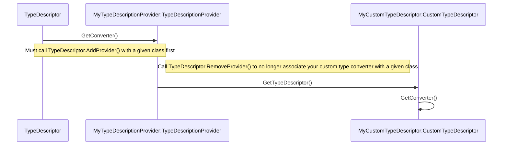

# Manually Registering a TypeConverter to a Class
A type converter is bound to a class by adding the [TypeConverterAttribute](https://learn.microsoft.com/dotnet/api/system.componentmodel.typeconverterattribute) to the class. However, there are some scenarios where it is not possible to add the attribute to the class. e.g. user may not own the class, but there is no type converter registered to that class for serialization. This document outlines how to manually register a [TypeConverter](https://learn.microsoft.com/dotnet/api/system.componentmodel.typeconverter) to a class for these scenarios.

## Prerequisite
Follow the steps to implement your own custom type converter listed [here](https://learn.microsoft.com/dotnet/api/system.componentmodel.typeconverter#notes-to-inheritors).

## Registering Your TypeConverter

### Background
A [TypeConverter](https://learn.microsoft.com/dotnet/api/system.componentmodel.typeconverter) for a given class is found via the `TypeDescriptor` static method [GetConverter()](https://learn.microsoft.com/dotnet/api/system.componentmodel.typedescriptor.getconverter). A custom type converter can be associated to a class by providing and registering a custom [ICustomTypeDescriptor](https://learn.microsoft.com/dotnet/api/system.componentmodel.icustomtypedescriptor). Only a single method of the `ICustomTypeDescriptor` methods is important for registering your own type converter. Thus, [CustomTypeDescriptor](https://learn.microsoft.com/dotnet/api/system.componentmodel.customtypedescriptor) is a useful existing class that can be utilized as a base class to provide a simple default implementation of `ICustomTypeDescriptor` while only the necessary method for registering your converter is overridden. [TypeDescriptor.AddProvider()](https://learn.microsoft.com/dotnet/api/system.componentmodel.typedescriptor.addprovider) is used to add a [TypeDescriptionProvider](https://learn.microsoft.com/dotnet/api/system.componentmodel.typedescriptionprovider) which will ultimately register your custom type converter to a given class. More details on this will follow.

### Implementing CustomTypeDescriptor
Inherit from [CustomTypeDescriptor](https://learn.microsoft.com/dotnet/api/system.componentmodel.customtypedescriptor) to get default [ICustomTypeDescriptor](https://learn.microsoft.com/dotnet/api/system.componentmodel.icustomtypedescriptor) behavior and override [GetConverter()](https://learn.microsoft.com/dotnet/api/system.componentmodel.customtypedescriptor.getconverter) to return your custom type converter. 
```c#
private class MyCustomTypeConverterDescriptor : CustomTypeDescriptor
{
    private TypeConverter _myConverter;

    public MyCustomTypeConverterDescriptor(ICustomTypeDescriptor parent, TypeConverter converter) : base(parent)
        => _myConverter = converter;

    public override TypeConverter GetConverter() => _myConverter;
}

```
`ICustomTypeDescriptor` is accessed through [TypeDescriptionProvider.GetTypeDescriptor](https://learn.microsoft.com/dotnet/api/system.componentmodel.typedescriptionprovider.gettypedescriptor). `TypeDescriptionProvider` is an existing abstract class that already has default behavior. `GetTypeDescriptor()` is the only method is important for registering your new `ICustomTypeDescriptor` and thus registering your custom type converter. Have another class inherit from `TypeDescriptionProvider` to get its default behavior and override `GetTypeDescriptor()` to provide `MyCustomTypeConverterDescriptor`.

```c#
public class MyTypeDescriptionProvider : TypeDescriptionProvider
{
    private TypeConverter _myConverter;

    public MyTypeDescriptionProvider(TypeDescriptionProvider parent, TypeConverter converter) : base(parent)
        => _myConverter = converter;

    public override ICustomTypeDescriptor GetTypeDescriptor(Type objectType, object instance) 
        => new MyCustomTypeConverterDescriptor(base.GetTypeDescriptor(objectType, instance), _myConverter);
}
```
Note: The parent `TypeDescriptionProvider` to be passed to the constructor can be grabbed by calling [TypeDescriptor.GetProvider()]() and passing in the class that is intended to be associated to your custom type converter.

### Registration/Deregistration
Once you have `MyTypeDescriptionProvider` and `MyCustomTypeConverterDescriptor` as outlined above, finish up registering your custom `TypeConverter` to a class by calling [TypeDescriptor.AddProvider()](https://learn.microsoft.com/dotnet/api/system.componentmodel.typedescriptor.addprovider) with parameters `MyTypeDescriptionProvider` and the class you want your custom converter to be associated with. 
```c#
TypeDescriptionProvider parentProvider = TypeDescriptor.GetProvider(type);
MyCustomTypeConverterDescriptor newProvider = new(parentProvider, myConverter);
TypeDescriptor.AddProvider(newProvider, type);
```
At this point, calling [TypeDescriptor.GetConverter()](https://learn.microsoft.com/dotnet/api/system.componentmodel.typedescriptor.getconverter) with the same class that was passed to `TypeDescriptor.AddProvider()` will return your custom type converter! 

If you want this type converter to be temporarily registered to the class, do not forget to call [TypeDescriptor.RemoveProvider()](https://learn.microsoft.com/dotnet/api/system.componentmodel.typedescriptor.removeprovider) when finished.
```c#
TypeDescriptor.RemoveProvider(newProvider, type);
```

## Additional Information

### TypeDescriptor.GetConverter() Details
This a static method on [TypeDescriptor](https://learn.microsoft.com/dotnet/api/system.componentmodel.typedescriptor) that will run through the its private list of [TypeDescriptionProviders](https://learn.microsoft.com/dotnet/api/system.componentmodel.typedescriptionprovider) and get the provider associated with the class. Once the right provider is found, it will then call [TypeDescriptionProvider.GetTypeDescriptor()](https://learn.microsoft.com/dotnet/api/system.componentmodel.typedescriptionprovider.gettypedescriptor) to get an [ICustomTypeDescriptor](https://learn.microsoft.com/dotnet/api/system.componentmodel.icustomtypedescriptor) and call [ICustomTypeDescriptor.GetConverter()](https://learn.microsoft.com/dotnet/api/system.componentmodel.icustomtypedescriptor.getconverter) to finally grab the class's associated [TypeConverter](https://learn.microsoft.com/dotnet/api/system.componentmodel.typeconverter). 

