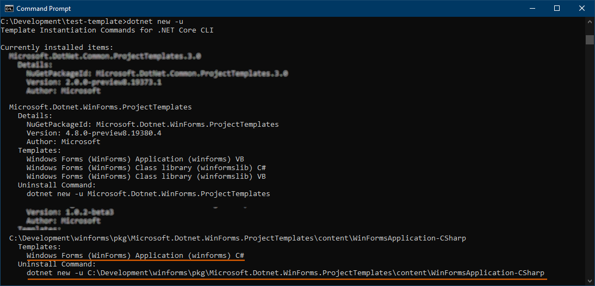

# Windows Forms Projects Templates

We provide the following templates:
* [Windows Forms app (C#)](./content/WinFormsApplication-CSharp)
* [Windows Forms app (VB)](./content/WinFormsApplication-VisualBasic)
* [Windows Forms class library (C#)](./content/WinFormsLibrary-CSharp)
* [Windows Forms class library (VB)](./content/WinFormsLibrary-VisualBasic)
* [Windows Forms control library (C#)](./content/WinFormsControlLibrary-CSharp)
* [Windows Forms control library (VB)](./content/WinFormsControlLibrary-VisualBasic)

## Testing Templates

Before submitting a change to any of the templates please make sure to test them locally.

1. Install the required template with `dotnet` tool (e.g. `WinFormsApplication-CSharp`).<br />
In the command prompt of your choice run the following command:
    ```
    > dotnet new -i <path to the repo>\winforms\pkg\Microsoft.Dotnet.WinForms.ProjectTemplates\content\WinFormsApplication-CSharp
    ```

2. To confirm that the template is correctly installed run the following command and look for your template:
    ```
    > dotnet new -u
    ```
    

3. Create an app from your template:
    ```
    > dotnet new winforms -n testapp1
    ```

4. Verify the app behaves as expected. <br />
If necessary, tweak the template and create new apps.

5. Once you are happy with the template, you can uninstall it to revert to the original by running the command given in `dotnet new -u` output; e.g.
    ```
    > dotnet new -u <path to the repo>\winforms\pkg\Microsoft.Dotnet.WinForms.ProjectTemplates\content\WinFormsApplication-CSharp
    ````
